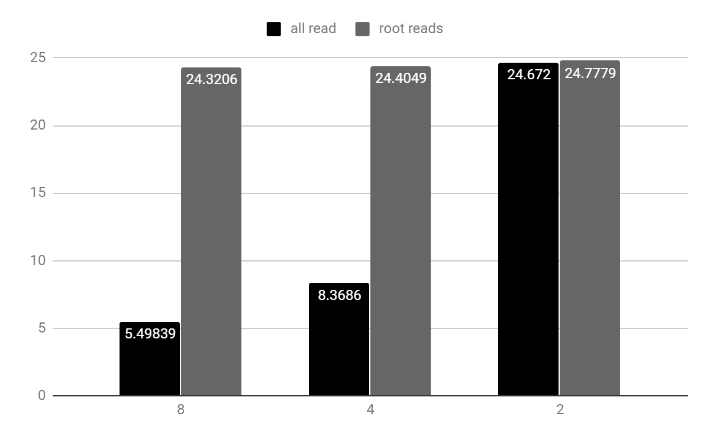

# **PPD: Laborator 2 - MPI (C++)**

## **Analiza cerințelor**

### **Cerințe**

Calculați suma a 2 numere mari (problema **A** laborator **1**) folosind MPI.

Cele două numere se citesc din două fișiere, iar rezultatul se salvează într-un alt fișier.

Se cere realizarea a două variante:

1. procesul 0 citește numerele și apoi le distribuie
2. toate procesele sunt implicate în citire

### **Constrângeri**

* un proces trebuie sa stocheze doar date pe care le proceseaza
* exceptie face procesul 0 in cazul **a)**

## **Proiectare**

### **Sumar**

Codul conține două funcții ce pot fi apelate in **main.cpp**, și anume, **all_read** și **root_reads**, aferente celor două variante cerute, în care toate procesele citesc numerele (pe intervale) și, respectiv, varianta în care doar procesul rădăcină citește numerele.

### **Descrierea algoritmului**

1. Varianta **all_read**

    1. procesul **root**
        1. deschide fișierele cu numerele, pe rând, și calculează lungimea fiecăruia
        2. apelează **MPI_Send** către celelalte procese cu lungimea maximă dintre cele două

    2. **celelalte** procese
        1. apelează **MPI_Recv** pentru a primi lungimea maximă
        2. calculează lungimea intervalului de cifre si pozițiile de unde citesc cifrele numerelor din fiecare fișier
        3. citesc pe rând și stochează intervalul corespunzător pentru cele două numere (cu cifrele **inversate**)
        4. calculează o **sumă** parțială între cele două intervale; rămâne un **carry**(=0/1) la finalul adunării, care va fi trimis ulterior la procesul vecin (**următorul** în rang)
        5. apelează **MPI_Recv**(în afară de primul proces) pentru a primi carry-ul procesului anterior și îl adaugă la sumă; în urma acestei adunări, carry-ul rămas (=0/1) va fi adunat la cel calculat la pasul anterior
        6. se apelează **MPI_Send**(în afară de ultimul proces) pentru a trimite carry-ul final la procesul vecin (**următorul** în rang)

    3. **toate** procesele
        1. strâng toate lungimile sumelor parțiale calculate în pașii **ii(a-f)** în procesul **root**, apelând **MPI_Gather**
        2. concatenează toate sumele într-un vector, de lungime egală cu suma lungimilor strânse anterior, în procesul **root**, apelând **MPI_Gatherv**

    4. procesul **root**
        1. afișează timpul trecut de la primul pas până la acest pas
        2. salvează suma într-un fișier (inversând cifrele la loc)
        3. salvează rezultatele execuției intr-un tabel

2. Varianta **root_reads**

    1. procesul **root**
        1. deschide fișierele cu numerele, pe rând, și calculează lungimea fiecăruia
        2. apelează **MPI_Send** către celelalte procese cu lungimea maximă dintre cele două
        3. citește numerele pe rând și le stochează (cu cifrele inversate)

    2. **celelalte** procese
        1. apelează **MPI_Recv** pentru a primi lungimea maximă

    3. **toate** procesele
        1. calculează lungimea intervalului propriu (procesul **root** cu 0) și apelează **MPI_Gather** pentru a strânge toate lungimile intervalelor după care se vor impărți numerele
        2. apelează **MPI_Scatterv** pe intervalele calculate anterior, fiecărui proces revenindu-i câte o parte corespunzătoare din cele două numere

    4. se urmează **aceiași** pași ca in varianta **1**, de la **ii(d)** la final

## **Testare**

### **Condiții de testare**

* Processor Intel Core i5-8250U CPU @ 1.60GHz, 1800 Mhz, 4 Cores, 8 Logical
* 8 GB RAM
* Performanța testată pe 2^27 (~134 milioane) cifre
* 5 rulări pentru fiecare caz (2/4/8 procese)
* unitatea pentru măsurarea timpului de execuție - **secunde**
