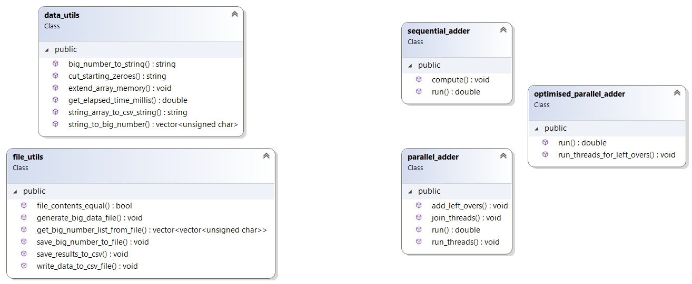
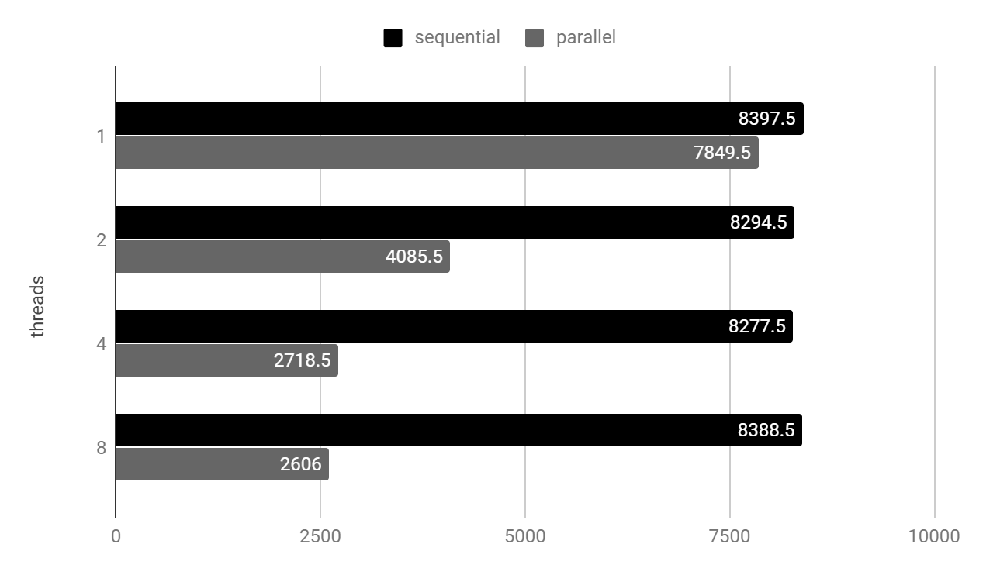

**PPD: Laborator 1b - C++**

# **Analiza cerințelor**

## **Cerințe**

Înmulțirea a două "numere mari" (= numere reprezentate pe tablouri de numere întregi fără semn, ordonate crescător după cea mai nesemnificativă cifră din număr), folosind algoritmi ce lucrează **secvențial **sau **paralel**.

## **Constrângeri**

* Datele de intrare (cele două numere de înmulțit) se vor citi dintr-un fișier generat anterior rulării programului, cu numere aleatoare având între x și y cifre (parametri variabili)

* Numărul de thread-uri este un parametru variabil, dat la rulare

* Programul va afișa la final timpul de execuție corespunzător fiecărei implementări

* Încărcarea echilibrată a fiecărui thread

* Folosirea funcțiilor implementate la laboratorul precedent (lab0)

# **Proiectare**

## **Sumar**

În **main**.cpp** **începe execuția programului, ce execută o serie de funcții (statice, pentru eficiență,  împărțite intuitiv în clase pe directoare, în funcție de responsabilitate și utilitate).

Se generează două numere aleatoare în fișiere. Se citesc cele două numere și se apelează succesiv algoritmii secvențial și paralel. Se printează timpul execuției fiecăruia și se salvează rezultatele intr-un fișier Excel (doar după ce se testează egalitatea rezultatelor).

Soluția acestui laborator este construită pe baza celei din laboratorul anterior (adunarea a 2 numere),

deoarece majoritatea funcțiilor utile si algoritmii implementați se pot refolosi în mod eficient și rapid în implementarea algoritmilor de înmulțire.

## **Diagrama de clase**

## **Descrierea algoritmului**

1. Varianta secvențială 

    1. Se alege un deînmulțit și un înmulțitor dintre cele două numere (optim înmulțitorul va fi numărul mai scurt)

    2. Pentru fiecare cifră din înmulțitor, se calculează produsul dintre cifră și înmulțitor în mod iterativ (cifră cu cifră), rezultând o listă de **N** produse parțiale ( N = numărul de cifre al înmulțitorului)

    3. Se adună toate produsele parțiale, iterativ, adunând număr cu număr la un subtotal, folosind algoritmul de adunare secvențială de la lab. **1a**

2. Varianta paralelă

    4. Identic variantei secvențiale, se aleg deînmulțitul și înmulțitorul

    5. Se alocă fiecărui din cele **P **thread-uri un interval de cifre din înmulțitor ( N/P + restul de cifre, distribuite în mod aproximativ egal)

    6. Fiecare thread calculează N/P produsuri parțiale între deînmulțit și cifrele înmulțitorului din intervalul primit și le adaugă intr-o listă comună

    7. Pentru **optimizare**, cele N produsuri parțiale sunt adunate în mod secvențial de **P **thread-uri, fiecare thread adunând N/P numere

    8. Cele N/P sume rezultate din adunarea produsurilor parțiale se vor aduna în mod secvențial de P thread-uri, fiecare adunând N/(P^2) numere; astfel, se va repeta pasul **d **până când lista de numere de adunat are o dimensiune mai mică decât 2*P (adică până când nu mai există un minim de 2 numere de adunat pentru fiecare thread)

    9. Rezultatul final se obține din adunarea secvențială a numerelor rămase (<2*P)

## **Optimizare**

* Folosirea unor tipuri de date optime (ca dimensiune, acces și siguranță):

    * vectori de tip **unsigned char** (echivalent **byte **in Java)

* Pasarea datelor folosind referinte** &**, folosind tipul **const**, oriunde e permis

* Folosirea containelor și funcțiilor specifice bibliotecii **STL**, pentru a folosi cod eficient și optimizat, dar și pentru a păstra algoritmii paraleli **thread-safe**, din punct de vedere al accesului concurent al datelor comune

* Obiecte create **local**, funcții care nu copiază date, pentru a evita crearea de memory leak-uri si a lăsa memoria să fie gestionată eficient în mod implicit

# **Testare**

## **Condiții de testare**

* Processor Intel Core i5-8250U CPU @ 1.60GHz, 1800 Mhz, 4 Cores, 8 Logical

* 8 GB RAM

* Performanța testată pe 2^15 (~33 mii) cifre

* 5 rulări pentru fiecare caz (1/2/4/8 thread-uri)

* unitatea pentru măsurarea timpului de execuție - **milisecunde**

