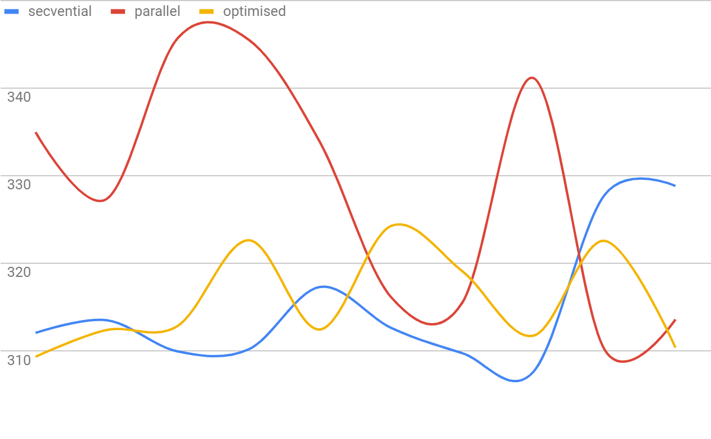
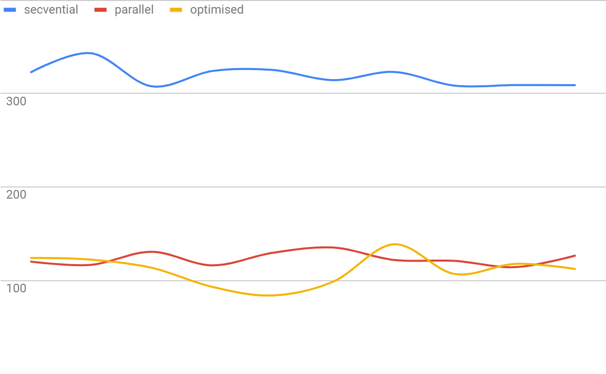

**PPD: Laborator 1a - C++**

# **Analiza cerințelor**

## **Cerințe**

Adunarea a două "numere mari" (= numere reprezentate pe tablouri de numere întregi fără semn, ordonate crescător după cea mai nesemnificativă cifră din număr), folosind algoritmi ce lucrează **secvențial **sau **paralel**, în două variante:

1.  **Varianta paralelă simplă ** consideră	rezolvarea problemei prin executia a 2 etape: 

    1. prima etapă împarte cifrele în mod echilibrat pe fiecare thread, calculând câte un carry pentru fiecare thread

    2. a doua etapă actualizează rezultatul secvențial, adunând carry-urile corespunzătoare fiecărui thread, după execuția tuturor

2. **Varianta paralelă optimizată** îmbunătațește varianta anterioara, fie paralelizând calculul etapei a doua, fie considerând un alt algoritm paralel mai eficient 

## **Constrângeri**

* Datele de intrare (cele două numere de adunat) se vor citi dintr-un fișier generat anterior rulării programului, cu numere aleatoare având între x și y cifre (parametri variabili)

* Numărul de thread-uri este un parametru variabil, dat la rulare

* Programul va afișa la final timpul de execuție corespunzător fiecărei implementări

* Încărcarea echilibrată a fiecărui thread

* Folosirea funcțiilor implementate la laboratorul precedent (lab0)

# **Proiectare**

## **Sumar**

În **main**.cpp** **începe execuția programului, ce execută o serie de funcții (statice, pentru eficiență,  împărțite intuitiv în clase pe directoare, în funcție de responsabilitate și utilitate).

Se generează două numere aleatoare în fișiere. Se citesc cele două numere și se apelează succesiv algoritmii secvențial, paralel și paralel optimizat. Se printează timpul execuției fiecăruia și se salvează rezultatele intr-un fișier Excel (doar după ce se testează egalitatea rezultatelor).

## **Diagrama de clase**

                       

                                      

## **Descrierea algoritmului**

1. Varianta secvențială 

    1. se parcurg cei doi vectori de cifre de la început la final, adunându-se cifră cu cifră, plus un carry posibil rezultat din adunarea cifrelor anterioare

    2. la final, dacă rămâne un carry, se adaugă la finalul vectorului de sumă

2. Varianta paralelă simplă 

    3. se alocă intervale de lungime egală fiecărui thread, urmând ca fiecare în parte să parcurga cei doi vectori de cifre pe intervalul dat, adunând cifră cu cifră la sumă, ținând cont de carry

    4. dacă la finalul adunării unui thread rămâne un carry, se salvează într-un dicționar împreună cu poziția următoare capătului intervalului (cea pe care trebuie adunat)

    5. se parcurge dicționarul de perechi poziție - carry, secvențial, adunându-se carry-urile la suma incompletă, pentru a da rezultatul final

3. Varianta paralelă optimizată

    6. identic variantei simple, se alocă intervale de lungime egală fiecărui thread, urmând ca fiecare în parte să parcurga cei doi vectori de cifre pe intervalul dat, adunând cifră cu cifră la sumă, ținând cont de carry

    7. se pune ultimul carry al thread-ului într-un vector comun, pe poziția cu id-ul thread-ului

    8. dicționarul de perechi poziție - carry va fi prelucrat in paralel, de același numar de thread-uri ca și înainte, acestea urmând a adăuga carry-ul rămas pe fiecare interval la suma incompletă, pentru a da rezultatul final

## **Optimizare**

* Folosirea unor tipuri de date optime(ca dimensiune, acces și siguranță):

    * vectori de tip **unsigned char** (echivalent **byte ** in Java)

    * carry stocat ca **bool** (ia valori exclusiv din {0,1})

* Pasarea datelor folosind referinte** &**, folosind tipul **const**, oriunde e permis

* Folosirea containelor și funcțiilor specifice bibliotecii **STL**, pentru a folosi cod eficient și optimizat, dar și pentru a păstra algoritmii paraleli **thread-safe**, din punct de vedere al accesului concurent al datelor comune

* Obiecte create **local**, funcții care nu copiază date, pentru a evita crearea de memory leak-uri si a lăsa memoria să fie gestionată eficient în mod implicit

# **Testare**

### **1 thread**

**Secvențial**: 315ms 		**Paralel**: 210ms		**Optimizat**: 210ms

### **2 thread-uri**

**Secvențial**: 320ms		**Paralel**: 186ms		**Optimizat**: 179ms

### **4 thread-uri**

**Secvențial**: 318ms		**Paralel**: 123ms		**Optimizat**: 112ms

### **8 thread-uri**

**Secvențial**: 319ms		**Paralel**: 103ms		**Optimizat**: 94ms

## **Condiții de testare**

* Processor Intel Core i5-8250U CPU @ 1.60GHz, 1800 Mhz, 4 Cores, 8 Logical

* 8 GB RAM (<1 GB folosită de executabil, limite implicite ?)

* Performanța testată pe 2^19 (~ 525 mii) cifre (performanță scăzută < Java)

* 10 rulări pentru fiecare caz (1/2/4/8 thread-uri)

